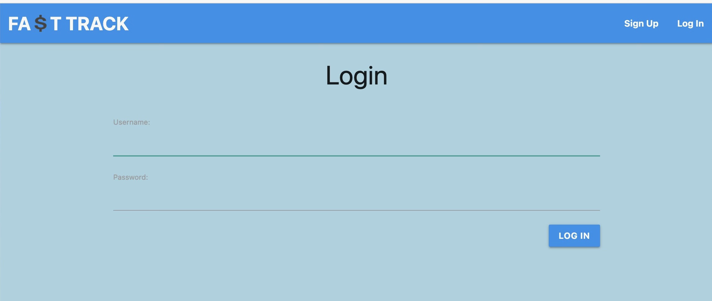
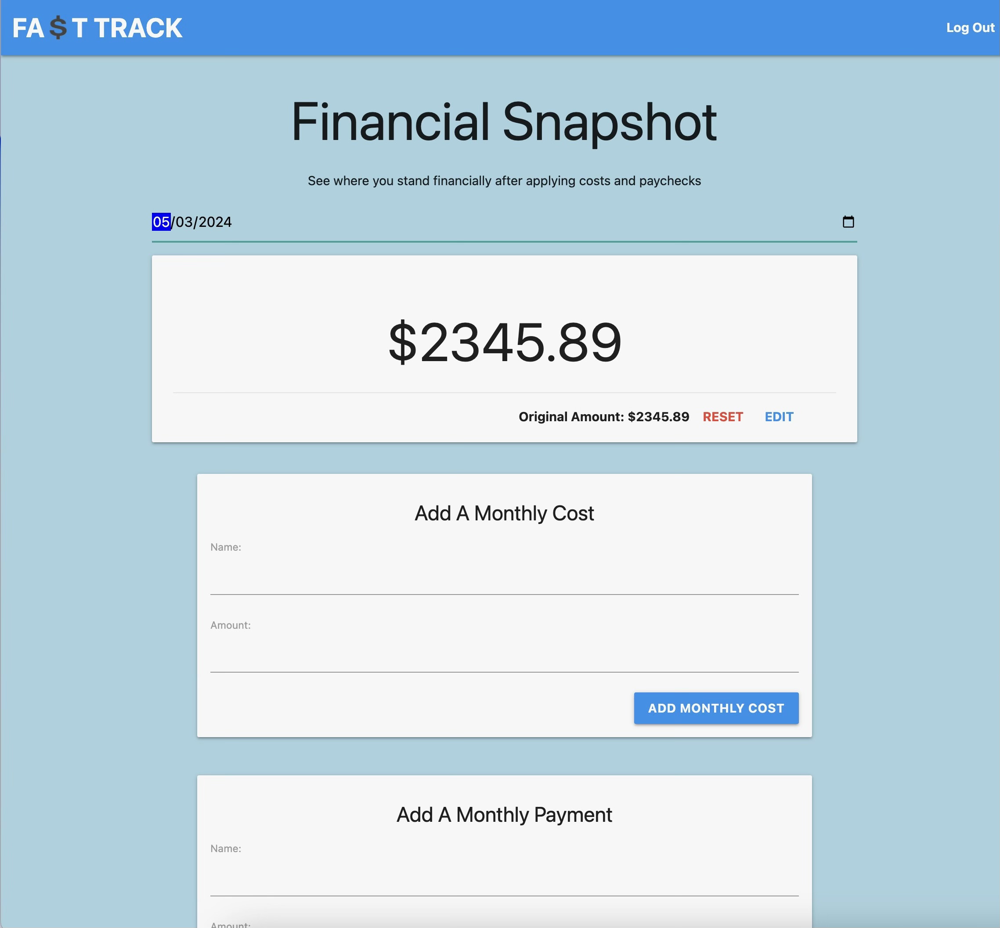
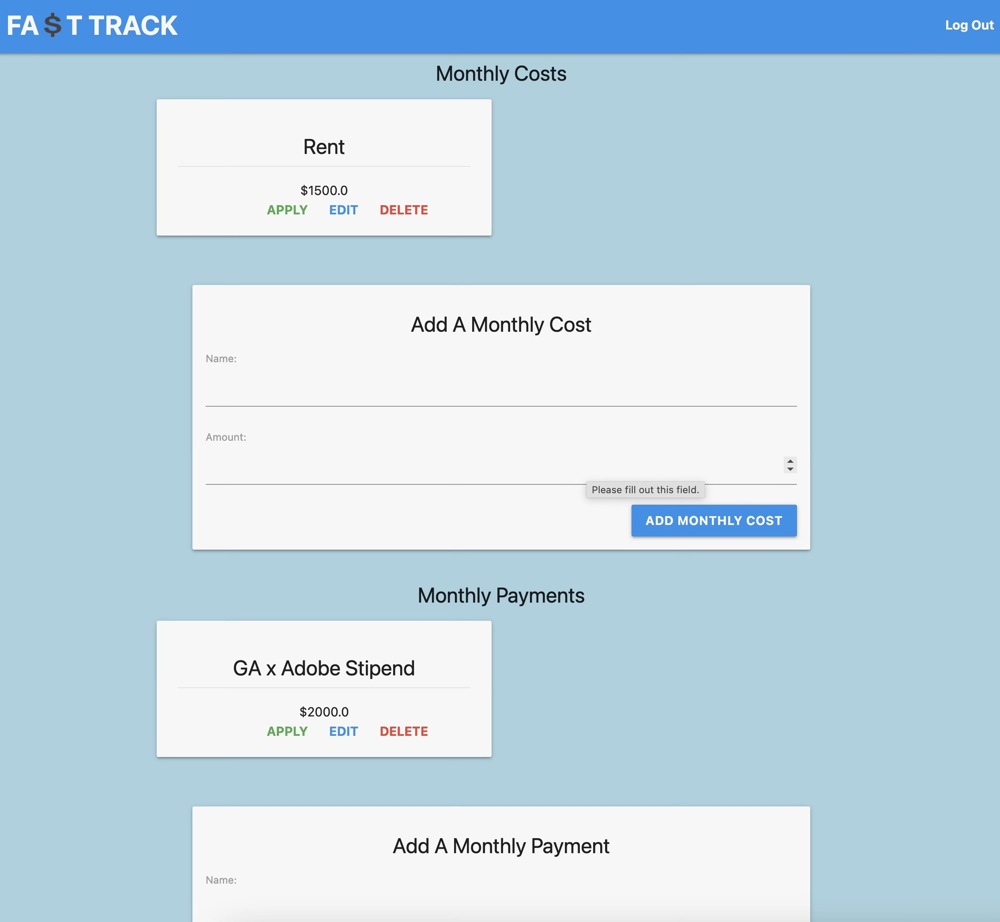
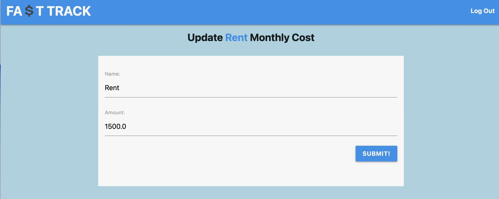
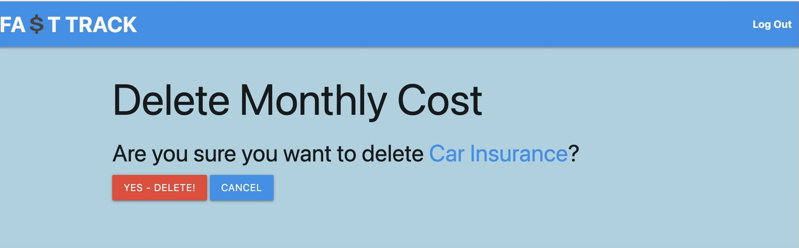
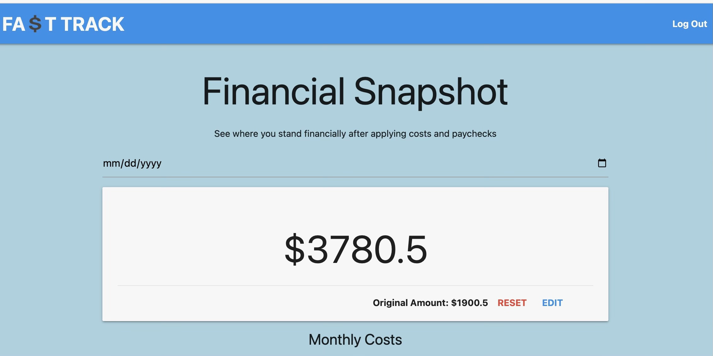

# Fa$tTrack

## Description:
Fasttrack is your go-to app for quick financial planning. Designed for individuals who prefer to crunch numbers swiftly, Fasttrack simplifies the process by providing a convenient space to store your monthly costs, paychecks, and planned purchases. With Fasttrack, you can effortlessly apply these figures to your current balance, allowing the app to handle the math for you. Stay on top of your finances with ease and efficiency!

# Screenshot

# Technologies Used

- JavaScript
- HTML
- CSS
- CardStarter CSS Library

# Getting Started

[Click to View Project Planning](your Trello url here)
[Click to Play Connect Four!](your deployment url here)

# Next Steps

- Future enhancement one...
- Future enhancement two... 