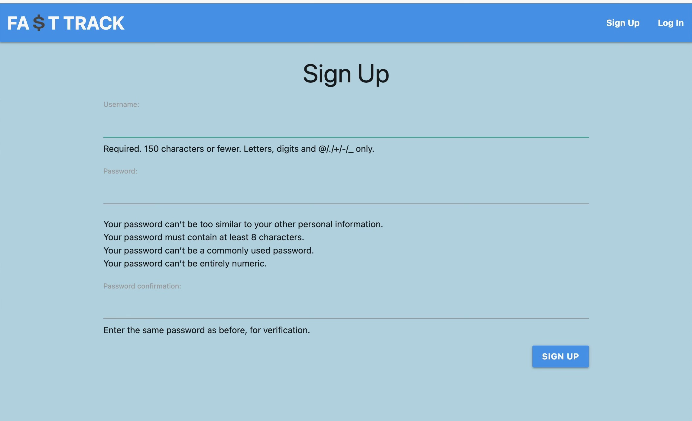
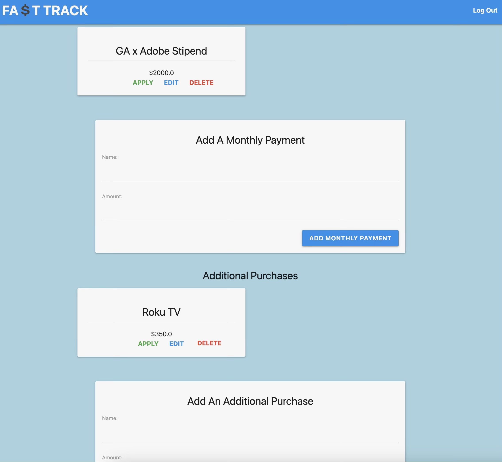

# Fa$tTrack

## Description:
Fasttrack is your go-to app for quick financial planning. Designed for individuals who prefer to crunch numbers swiftly, Fasttrack simplifies the process by providing a convenient space to store your monthly costs, paychecks, and planned purchases. With Fasttrack, you can effortlessly apply these figures to your current balance, allowing the app to handle the math for you. Stay on top of your finances with ease and efficiency!

# Screenshot

## Sign Up or Login
The user begins with being prompted to either sign up or login. This allows for us to save information pertaining to that user and to then be able to display that users info. 

## Home Starting Display
As the user first logs in, the website will look a little empty filled with nothing but forms to direct through fillinf out all forms to make the best out of the website.

## Display Balance
Upong the user add their current balance, that balance will display at the top to then
change whenever a user applies a cost or payment. Below is the original amount so that users
will always have in mind the amount they actually currently have. Purposely, no delete here as the idea is that they wont need to delete but only update their balance whenever they login. 

## Cost, Payments, and Additional Purchases
Displayed below are the monthly costs/payments the user decides to include. Each with an edit and delete but most importantly an apply. The idea here is that users will go based off the date their visiting the app and apply certain costs/payment that are upcoming up to a certain date of their choice. Overall -- helping users see where they will be financially will the applied costs/payments.

## Update View
Below is typically what all the edit/update views look like for all.

## Delete View
Below is also what all the delete views basically look like. However, some do not have a confirm delete. Additional Purchases does not have a confirm delete because that idea is since its not consistent like the others you can simply and confidently remove it.

## Reset
After the user has applied all costs and expenses, or made an error within the process, or would like to try differently - the current balance is presented with a reset button. When the user clicks to reset, the balance will go back to its original.

# Technologies Used

- Python
- Django
- Neon
- HTML
- CSS

# Getting Started
<!-- https://trello.com/invite/b/hyvPril6/ATTI9732b26baee1dbbecec1ea726abb3548FB389116/fat-track  -->
[Click to View Project Planning](https://trello.com/invite/b/hyvPril6/ATTI9732b26baee1dbbecec1ea726abb3548FB389116/fat-track)
[Click to Play Connect Four!](your deployment url here)

# Next Steps

- Future enhancement one...
- Future enhancement two... 